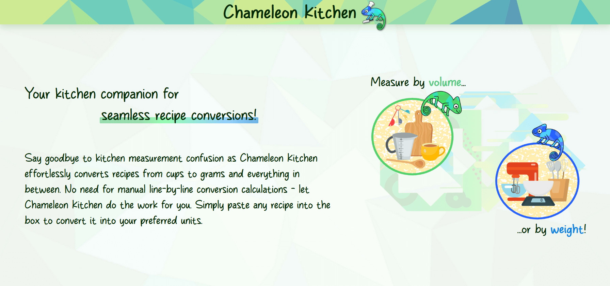
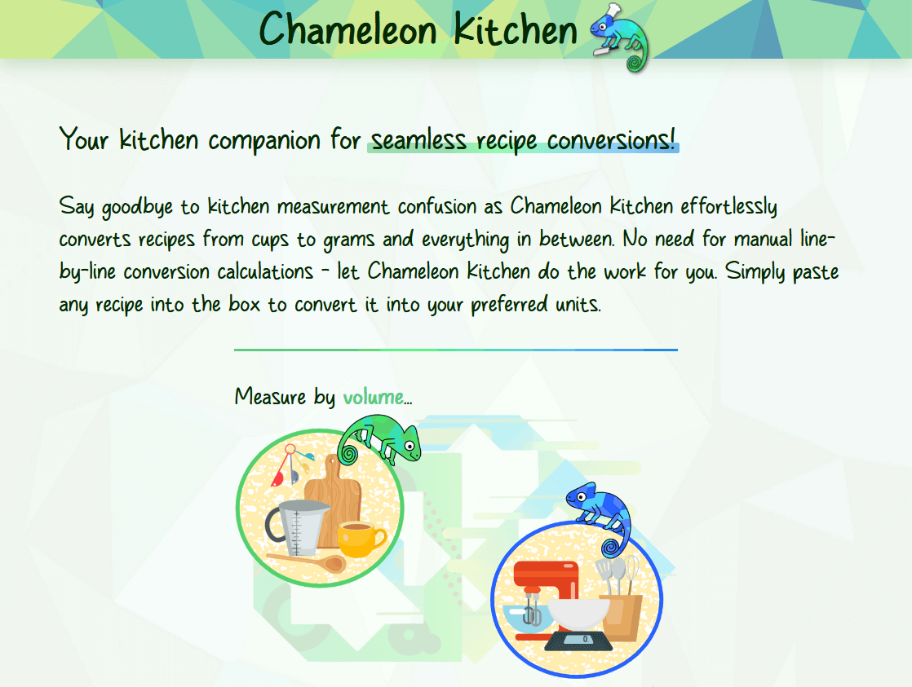
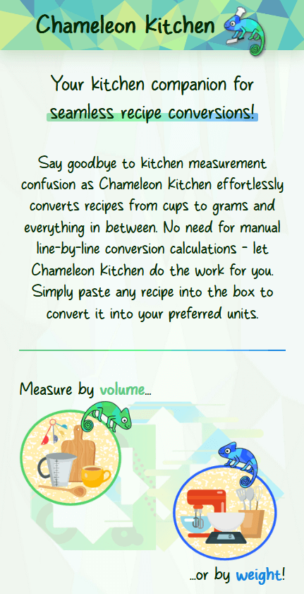

# Chameleon Kitchen

<!-- TABLE OF CONTENTS -->
  
<h2 style="display: inline-block">Table of Contents</h2>

  

    <ul>
      <li>
        <a href="#about-the-project">About the project</a>
      </li>
      <li>
        <a href="#demo-and-screenshots">Demo and screenshots</a>
      </li>
      <li>
        <a href="#installation-and-setup-instructions">Installation and setup instructions</a>
      </li>
      <li>
        <a href="#technologies-used">Technologies used</a>
      </li>
      <li>
        <a href="#current-issues">Current issues</a>
      </li>
      <li>
        <a href="#contributing">Contributing</a>
      </li>
      <li>
        <a href="#license">License</a>
      </li>
    </ul>
  

## About the project
<a href="https://chameleon-kitchen.pages.dev/" target="_blank">Chameleon Kitchen</a> is an open-source ingredient converter designed to make finding recipes more accessible for everyone. Simply type or paste a recipe into the text box and Chameleon Kitchen will convert the recipe into your desired units. Converting an entire recipe between cups and grams can be tricky and time-consuming as the weight/volume ratio is not the same for all foods (e.g. 1 cup of sugar doesn't weigh the same as 1 cup of flour), meaning direct conversions are not possible. Chameleon Kitchen uses the [Spoonacular API](https://spoonacular.com/api/docs/recipes-api) to parse ingredients and then makes a second request to convert them, ensuring a correct conversion for every ingredient in seconds.
  

## Demo and screenshots
Chameleon Kitchen is fully responsive and looks great on all screen sizes. Here's the intro section for desktop, tablet, and mobile:
 

  
    
  
  

 
<h1 style="border-bottom: none;">
  Live version <a href="https://chameleon-kitchen.pages.dev/" target="_blank" rel="noreferrer">here</a>.
</h1>

## Installation and setup instructions
This project was bootstrapped with [Vite](https://vitejs.dev/).

### Installation
First clone the repository to your local machine and navigate to the project directory.

Then install the project dependencies using:

#### `npm install`

You can run the app in development mode using:

#### `vite`

Then open [http://127.0.0.1:5173/](http://127.0.0.1:5173/) to view it in your browser. The page will reload when you make changes.

To run the app in production, you can compile and optimize the app for deployment using:
#### `npm run build`

This creates a production-ready build in the `dist` folder.
  

## Technologies used
* [React](https://react.dev/) bootstrapped with [Vite](https://vitejs.dev/)
* [TypeScript](https://www.typescriptlang.org/)
* [Sass](https://sass-lang.com/)

Chameleon Kitchen uses the [Spoonacular API](https://spoonacular.com/api/docs/recipes-api) to parse and convert ingredients.
  

## Image attribution
<a href="https://www.freepik.com/free-vector/gradient-background-blue-green-color-triangle-polygon-modern-design-abstract_34426762.htm">Image by logturnal</a> on Freepik
 
<a href="https://www.freepik.com/free-vector/knife-set-cooking-utensils-graphic_2685780.htm">Image by rawpixel.com</a> on Freepik
 
Image by <a href="https://www.freepik.com/free-vector/collection-chef-hats-flat-design_1125050.htm">Freepik</a>
 
Image by <a href="https://www.freepik.com/free-vector/flat-colorful-frame-collection_2316820.htm">Freepik</a>
 
<a href="https://www.freepik.com/free-vector/collection-various-object-kitchen-graphic-designer-with-pot-kettle-knife-kitchenware-cartoon-character-flat-vector-illustration_23245599.htm">Image by jcomp</a> on Freepik
 
Image by <a href="https://www.freepik.com/free-vector/pack-nice-elements-cooking-flat-design_1128228.htm">Freepik</a>
 
<a href="https://www.freepik.com/free-vector/bakery-icon-flat_1531493.htm">Image by macrovector</a> on Freepik
 
Image by <a href="https://www.freepik.com/free-vector/set-illustrated-kitchen-elements_7773595.htm">Freepik</a>
 
<a href="https://www.freepik.com/free-vector/modern-various-kitchen-tools-flat-icon-set_9176028.htm">Image by pch.vector</a> on Freepik

## Current issues
The only current issue is the extremely low API limits from the [Spoonacular API](https://spoonacular.com/api/docs/recipes-api)

There are no other known issues. If you find a bug, please open an issue [here](https://github.com/AmyMaule/chameleon-kitchen/issues/new), including as much information as you can.
  

## Contributing
If you wish to request or contribute a new feature, feel free to open an issue [here](https://github.com/AmyMaule/chameleon-kitchen/issues/new).
  

## License
MIT © [Amy Maule](https://github.com/AmyMaule)
